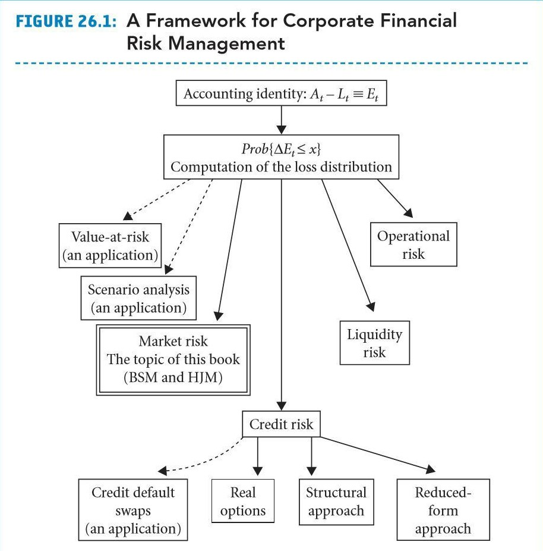

<h1 align="center">Portfolio Risk Management</h1>

Quantitative solution to portfolio management in Python based on Figure 26.1 from the textbook: Jarrow and Chatterjea, An Introduction to Derivative Securities, Financial Markets, and Risk Management, 1st Edition (ISBN: 978-0-13-601586-4) 

<h1 align="center"></h1>

## 🤝 Contributing

Contributions, issues and feature requests are welcome. 
[Check the contributing guide](Contributing.md). 

## 📝 License

This project is [MIT] licensed.
